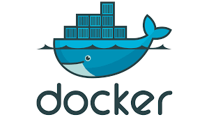
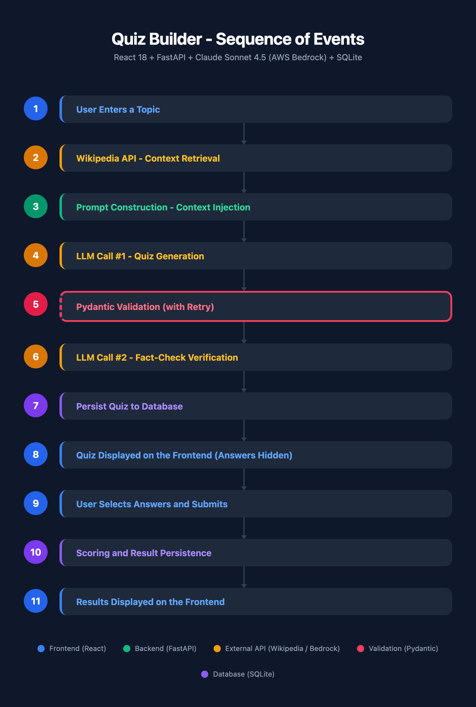

# Quiz Builder - Technical Presentation

## AI-Powered Knowledge Quiz Generator

**Live App:** https://6s9kx6uqpp.us-west-2.awsapprunner.com/

**Stack:** FastAPI + React 18 + Claude Sonnet 4.5 + AWS Bedrock + SQLite + AWS App Runner

 &nbsp;&nbsp;&nbsp;  &nbsp;&nbsp;&nbsp;  &nbsp;&nbsp;&nbsp;  &nbsp;&nbsp;&nbsp;  &nbsp;&nbsp;&nbsp;  &nbsp;&nbsp;&nbsp;  &nbsp;&nbsp;&nbsp; 

---

## Why Claude Sonnet 4.5?

**Claude Sonnet 4.5** was chosen for its balance of quality, reliability, and cost:
- **AWS-native** - Bedrock integration means credentials flow through IAM with no separate API keys to manage
- **Cost/latency sweet spot** - Better question quality than Haiku at acceptable latency (~6-10s). Opus would add cost and latency not justified for a 5-question quiz

## Schema Control vs. Hallucination Control

This app addresses two distinct risks when working with LLM output:

- **Schema control (is the output structurally valid?)** is handled by **Pydantic**. Every LLM response is validated through the `GeneratedQuestion` model, which enforces: all required fields present, correct data types, and `correct_answer` restricted to A/B/C/D. If validation fails, the app retries the LLM call up to 3 times.

- **Hallucination control (is the output factually correct?)** is handled by two layers:
  1. **Wikipedia context injection** - Grounds the LLM in factual source material at generation time, reducing the chance of fabricated facts
  2. **A second LLM call (fact-check verification)** - Claude reviews each generated question against the Wikipedia context and corrects any wrong answers

Pydantic ensures the quiz is *well-formed*. Wikipedia + the verification call ensure the quiz is *accurate*.

---

## Sequence of Events



---

- [1. User Enters a Topic](#1-user-enters-a-topic)
- [2. Wikipedia API - Context Retrieval](#2-wikipedia-api---context-retrieval)
- [3. Prompt Construction - Context Injection](#3-prompt-construction---context-injection)
- [4. LLM Call #1 - Quiz Generation](#4-llm-call-1---quiz-generation)
- [5. Pydantic Validation (with Retry)](#5-pydantic-validation-with-retry)
- [6. LLM Call #2 - Fact-Check Verification](#6-llm-call-2---fact-check-verification)
- [7. Persist Quiz to Database](#7-persist-quiz-to-database)
- [8. Quiz Displayed on the Frontend (Answers Hidden)](#8-quiz-displayed-on-the-frontend-answers-hidden)
- [9. User Selects Answers and Submits](#9-user-selects-answers-and-submits)
- [10. Scoring and Result Persistence](#10-scoring-and-result-persistence)
- [11. Results Displayed on the Frontend](#11-results-displayed-on-the-frontend)

---

### 1. User Enters a Topic

The user types a topic into the frontend (e.g., "Photosynthesis", "Neural Networks", "Ancient Rome") and clicks "Generate Quiz."

- The React frontend (`Home.jsx`) sends a `POST /api/quiz/generate` request with the topic as the body.
- FastAPI validates the request through the `GenerateRequest` Pydantic model:

```python
class GenerateRequest(BaseModel):
    topic: str = Field(..., min_length=1, max_length=200)
```

- This enforces that the topic is a non-empty string with a max length of 200 characters. Malformed requests are rejected with a 422 error before any processing begins.

---

### 2. Wikipedia API - Context Retrieval


The backend fetches factual grounding material from Wikipedia before calling the LLM.

- `wikipedia.py` sends an async GET request (via `httpx`) to `https://en.wikipedia.org/api/rest_v1/page/summary/{topic}`.
- This returns a concise 1-3 paragraph extract, which is the highest-signal content for any given topic.
- The call has a 5-second timeout. If no article exists or the request fails, the quiz is still generated using the model's training knowledge alone. Wikipedia context is helpful but not required.
- **Why summaries, not full articles?** The summary fits entirely in the LLM prompt without chunking, has a higher signal-to-noise ratio than a full article (no "See also" sections, footnotes, etc.), and takes ~100ms to fetch.

---

### 3. Prompt Construction - Context Injection

The Wikipedia summary is injected directly into the LLM prompt as reference material. Here is the prompt before and after injection, using "Neural Networks" as an example topic.

**Before injection (no Wikipedia context available):**

```
Generate a quiz about: Neural Networks

Create exactly 5 multiple-choice questions. Each question must have 4 options (A-D) with exactly one correct answer.

Respond with ONLY valid JSON in this exact format:
{
  "questions": [
    {
      "question_text": "...",
      "option_a": "...",
      "option_b": "...",
      "option_c": "...",
      "option_d": "...",
      "correct_answer": "A",
      "explanation": "Brief explanation of why the correct answer is right and why the others are wrong."
    }
  ]
}

Rules:
- Questions should test understanding, not just recall
- Distractors should be plausible but clearly wrong
- Vary question difficulty (2 easy, 2 medium, 1 hard)
- Explanations should be 1-2 sentences
- correct_answer must be exactly one of: A, B, C, D
```

**After injection (Wikipedia context retrieved):**

```
Generate a quiz about: Neural Networks

Use the following reference material to ensure factual accuracy:
---
A neural network is a group of interconnected units called neurons that send
signals to one another. Neurons can be either biological cells or mathematical
models. While individual neurons are simple, many of them together in a network
can perform complex tasks. There are two main types of neural networks.In
neuroscience, a biological neural network is a physical structure found in
brains and complex nervous systems - a population of nerve cells connected by
synapses. In machine learning, an artificial neural network is a mathematical
model used to approximate nonlinear functions. Artificial neural networks are
used to solve artificial intelligence problems.
---

Create exactly 5 multiple-choice questions. Each question must have 4 options (A-D) with exactly one correct answer.

Respond with ONLY valid JSON in this exact format:
{
  "questions": [
    {
      "question_text": "...",
      "option_a": "...",
      "option_b": "...",
      "option_c": "...",
      "option_d": "...",
      "correct_answer": "A",
      "explanation": "Brief explanation of why the correct answer is right and why the others are wrong."
    }
  ]
}

Rules:
- Questions should test understanding, not just recall
- Distractors should be plausible but clearly wrong
- Vary question difficulty (2 easy, 2 medium, 1 hard)
- Explanations should be 1-2 sentences
- correct_answer must be exactly one of: A, B, C, D
```

The only difference is the reference material block between the topic line and the instructions. When Wikipedia has no article for a topic, that block is simply absent and the LLM relies on its training knowledge alone.

---

### 4. LLM Call #1 - Quiz Generation

 

The prompt is sent to **Claude Sonnet 4.5** via **AWS Bedrock**.

- The backend calls `bedrock_client.converse()` with the constructed prompt.
- The model generates 5 multiple-choice questions, each with 4 options (A-D), one correct answer, and an explanation.
- **Why Claude Sonnet 4.5?** It reliably produces well-formed JSON (critical for programmatic parsing), has strong factual reasoning, and integrates natively with AWS Bedrock so credentials flow through IAM with no separate API keys.
- **Temperature is left at the default (1.0).** This is intentional - it means a user can generate "Neural Networks" twice and get different questions each time, which is desirable for a quiz app. If the higher variance occasionally causes a format issue, the Pydantic validation + retry logic in step 5 catches it.

---

### 5. Pydantic Validation (with Retry)

Every LLM response is parsed and validated before the app trusts it.

- The raw response is cleaned (markdown code fences stripped if present), parsed as JSON, then each question is validated through the `GeneratedQuestion` Pydantic model:

```python
class GeneratedQuestion(BaseModel):
    """Validates a single question from the LLM response."""
    question_text: str
    option_a: str
    option_b: str
    option_c: str
    option_d: str
    correct_answer: Literal["A", "B", "C", "D"]
    explanation: str | None = None
```

- Pydantic enforces: exactly 5 questions, all required fields present, `correct_answer` must be one of A/B/C/D (via `Literal` type), and correct data types throughout.
- **If validation fails**, the app retries the LLM call - up to 3 total attempts. Each retry is a fresh Bedrock call, not a re-parse of the same output.
- Only after all 3 attempts fail does the user see an error.

---

### 6. LLM Call #2 - Fact-Check Verification

 

A second LLM call reviews the generated questions for factual accuracy. The generated questions are serialized as JSON and sent in a new prompt:

```
You are a fact-checker. Review the following quiz questions about "Neural
Networks" and verify that each question's correct_answer is factually accurate.

Reference material:
---
A neural network is a group of interconnected units called neurons that send
signals to one another. Neurons can be either biological cells or mathematical
models. While individual neurons are simple, many of them together in a network
can perform complex tasks. There are two main types of neural networks.In
neuroscience, a biological neural network is a physical structure found in
brains and complex nervous systems - a population of nerve cells connected by
synapses. In machine learning, an artificial neural network is a mathematical
model used to approximate nonlinear functions. Artificial neural networks are
used to solve artificial intelligence problems.
---

Questions to verify:
[
  {
    "question_text": "What is the basic unit...",
    "option_a": "...",
    "option_b": "...",
    "option_c": "...",
    "option_d": "...",
    "correct_answer": "A",
    "explanation": "..."
  },
  ... (all 5 generated questions)
]

For each question, determine if the marked correct_answer is truly correct.
If a question has an incorrect correct_answer, fix it by changing the
correct_answer field to the right letter and updating the explanation.

Respond with ONLY valid JSON in this exact format:
{
  "questions": [
    {
      "question_text": "...",
      "option_a": "...",
      "option_b": "...",
      "option_c": "...",
      "option_d": "...",
      "correct_answer": "A",
      "explanation": "..."
    }
  ]
}

Return all 5 questions. Keep questions unchanged if they are correct.
Only modify questions that have factual errors.
```

- The model checks whether each question's marked `correct_answer` is truly correct. If it finds an error, it corrects the answer and updates the explanation.
- The verification output goes through the same `GeneratedQuestion` Pydantic validation and retry logic (up to 3 attempts).
- **Graceful fallback:** If all verification retries fail, the app uses the original unverified questions rather than failing entirely. A slightly less-verified quiz is better than no quiz.

---

### 7. Persist Quiz to Database


The validated questions are saved to SQLite before the user ever sees them.

- A `Quiz` record (topic + timestamp) is created, then 5 `Question` records (question text, options A-D, correct answer, explanation) are linked to it via foreign key.
- **The database is SQLite** - chosen for this MVP because it requires zero infrastructure and makes the app fully self-contained. It persists for the lifetime of the container but does not survive App Runner container restarts. Switching to PostgreSQL (e.g., Amazon RDS) only requires changing the `DATABASE_URL` connection string; no code changes needed because SQLAlchemy abstracts the engine.

---

### 8. Quiz Displayed on the Frontend (Answers Hidden)

The backend returns the quiz to the frontend with correct answers deliberately omitted.

- The response is serialized through these Pydantic schemas:

```python
class QuestionOut(BaseModel):
    id: int
    question_text: str
    option_a: str
    option_b: str
    option_c: str
    option_d: str
    # No correct_answer. No explanation.


class QuizOut(BaseModel):
    id: int
    topic: str
    created_at: datetime
    questions: list[QuestionOut]
```

- `QuestionOut` contains the question text and options A-D but **excludes** `correct_answer` and `explanation`. This is an intentional anti-cheating measure: even inspecting the network response in browser dev tools will not reveal the answers before submission.
- The React frontend (`Quiz.jsx`) renders 5 `QuestionCard` components, each with radio buttons for A-D. A progress indicator shows how many questions have been answered.

---

### 9. User Selects Answers and Submits

The user selects one answer per question and clicks "Submit Quiz."

- Answer selections are tracked in React component state (`useState` hook). The submit button is disabled until all 5 questions are answered.
- On submit, the frontend sends a `POST /api/quiz/{id}/submit` request with the user's answers, validated through:

```python
class SubmitRequest(BaseModel):
    answers: dict[str, str]  # { "question_id": "A", "question_id": "B", ... }
```

- The `answers` field is a dictionary mapping question IDs to the user's selected letters (A-D).

---

### 10. Scoring and Result Persistence

The backend compares the user's answers against the stored correct answers and saves the result.

- For each question, the user's selected letter is compared to the `correct_answer` stored in the database. The score is computed as a simple count of correct answers out of 5.
- A `QuizResult` record is persisted to the database containing: the quiz ID, score, total, the user's answers (as JSON), and a timestamp.
- This persistence enables the History page - users can browse all past quizzes and see their scores.
- **How long do results last?** The SQLite database is a file on the container's local filesystem. Results persist for as long as the App Runner container stays alive. When the container restarts (deploy, crash, scaling event, or idle shutdown), the file is gone and the database starts fresh. Switching to PostgreSQL on RDS would make persistence durable - and that's a one-line config change.

---

### 11. Results Displayed on the Frontend

The submit response includes the full question data (now with correct answers and explanations revealed).

- The `SubmitResponse` returns the score, all 5 questions via `QuestionWithAnswer` (which now includes `correct_answer` and `explanation`), and the user's submitted answers.
- The frontend caches this result in `sessionStorage` for instant display on the Results page.
- `Results.jsx` renders a color-coded score badge (e.g., "Excellent" for 5/5, "Keep learning" for 0-2/5) and each question shows:
  - The user's answer vs. the correct answer
  - Green/red visual indicators for correct/incorrect
  - The AI-generated explanation for the correct answer

---

## Key Technical Decisions

| Decision | Rationale |
|---|---|
| **Two-step LLM (generate + verify)** | Catches factually incorrect answers; falls back gracefully if verification fails |
| **Pydantic at every boundary** | Validates requests, LLM output, responses, and app config with a single consistent pattern |
| **Retry logic on LLM calls** | LLMs are non-deterministic; retrying up to 3x with re-validation handles transient format failures |
| **Answers hidden until submit** | Separate Pydantic schemas (`QuestionOut` vs `QuestionWithAnswer`) prevent cheating via dev tools |
| **Wikipedia summary (not full RAG)** | 80% of accuracy benefit at 10% of complexity; fits in prompt without chunking |
| **SQLite for MVP** | Zero infrastructure, self-contained; migration to PostgreSQL is a one-line config change |
| **JSON prompting (not tool_use)** | For a fixed, simple schema, raw JSON prompting + Pydantic validation is simpler and sufficient |

---

## Docker Image & Deployment

The app ships as a single **multi-stage Docker image** built via a SageMaker notebook and pushed to AWS ECR, then deployed on App Runner.

```dockerfile
# ==========================
# Stage 1: Build React frontend
# ==========================
FROM node:20-alpine AS frontend-builder

WORKDIR /app/frontend

# Install frontend dependencies
COPY frontend/package*.json ./
RUN npm install --no-audit --progress=false

# Copy source and build production assets
COPY frontend/ ./
RUN npm run build


# ==========================
# Stage 2: Build Python backend (FastAPI)
# ==========================
FROM python:3.11-slim AS backend

# Prevent Python from writing .pyc files & buffering stdout/stderr
ENV PYTHONDONTWRITEBYTECODE=1 \
    PYTHONUNBUFFERED=1

WORKDIR /app

# Copy and install backend dependencies
COPY backend/requirements.txt .
RUN pip install --no-cache-dir -r requirements.txt

# Copy backend source code
COPY backend/ ./

# Copy built frontend assets into the container (FastAPI serves these)
COPY --from=frontend-builder /app/frontend/dist ./frontend_build

# Expose port (App Runner compatible)
EXPOSE 5000

# Run FastAPI with gunicorn + uvicorn workers (production)
CMD ["gunicorn", "main:app", \
     "--workers", "2", \
     "--worker-class", "uvicorn.workers.UvicornWorker", \
     "--bind", "0.0.0.0:5000", \
     "--timeout", "300", \
     "--keep-alive", "65", \
     "--access-logfile", "-"]
```

**Why a single image?** For an MVP, one container simplifies deployment: one App Runner service, one health check, one set of environment variables. The frontend is just static files served by FastAPI, so there's no runtime overhead.

**Why SageMaker for the build?** The AWS credentials and Docker runtime are already available in SageMaker, so the notebook can build the image and push to ECR.
